<p align="center">
  
</p>

<p align="center">
  
</p>

<p align="center">
  
</p>

<p align="center">
  
</p>

<p align="center">
  <a href="https://github.com/n3xtpy">
    </a>
  <a href="https://github.com/n3xtpy/n3xtpy/actions/workflows/update-profile-art.yml">
    </a>
  <a href="#how-this-readme-builds-itself">
    </a>
</p>

<br>

<details>
<summary><b id="how-this-readme-builds-itself">How this README builds itself</b></summary>

<br>

Every image above is an SVG generated by a Python script and refreshed by a
scheduled GitHub Action — nothing here is hand-drawn, and nothing is fetched
from a third-party service at render time.

| Card | Script | Source of truth |
| --- | --- | --- |
| `header.svg` | `scripts/generate_header.py` | static — no network |
| `neofetch-card.svg` | `scripts/generate_neofetch.py` | `api.github.com/users/:me` + `assets/source-logo.png` |
| `heatmap.svg` | `scripts/generate_heatmap.py` | the public contributions calendar |
| `langs.svg` | `scripts/generate_langs.py` | bytes of source per language, across public repos |

**One system, not four widgets.** All four share a palette, a type scale and a
card shell from `scripts/theme.py`: same 860px width, same gutters, same
GitHub Primer colours, one accent per card. Motion is there to confirm the
card has loaded — things fade and grow into place once and then settle, and
the only thing still moving afterwards is the caret in the banner.

**Why plain SVG.** GitHub renders README images inside an `` tag, which
runs CSS animations and SMIL but blocks scripts, external stylesheets and
webfonts. So the animation is all declarative — the typewriter is a `clipPath`
wipe, the bars are `width` animations, the reveals are `opacity` keyframes —
and every font stack ends in `monospace`. The logo portrait is drawn as a grid
of rects rather than ASCII for the same reason: rects always render, glyph art
depends on the viewer owning the glyphs.

**Failure is a no-op.** If the GitHub API rate-limits the runner or the
calendar scrape comes back empty, the scripts log a skip and exit `0` without
writing. A bad network day leaves yesterday's card in place instead of
committing a blank one.

Run them yourself:

```bash
pip install -r requirements.txt
python scripts/generate_header.py   n3xtpy
python scripts/generate_neofetch.py n3xtpy
python scripts/generate_heatmap.py  n3xtpy
python scripts/generate_langs.py    n3xtpy
```

</details>
